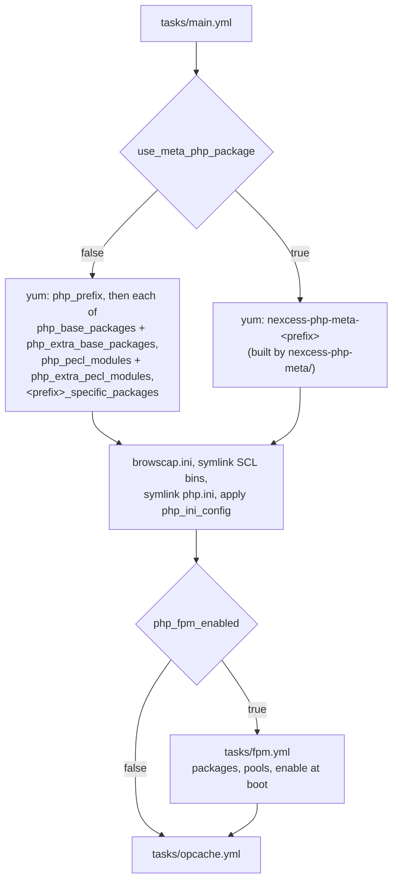

# ansible-role-php

Ansible role that installs a Remi SCL PHP stack on EL7 and EL9 hosts, with optional PHP-FPM pools and OpCache configuration.

## Architecture in a paragraph

Nexcess hosts run several PHP versions side by side, so this role installs Remi's
Software Collections builds under `/opt/remi/<prefix>` instead of the distro PHP. One run
installs exactly one version, chosen by `php_prefix` (default `php71`); run the role again
with a different prefix to stack another version on the same host. `tasks/main.yml` is the
entry point and branches on `use_meta_php_package`: the default (`false`) installs each RPM
individually from the `php_base_packages`, `php_pecl_modules`, and `<prefix>_specific_packages`
lists in `defaults/main.yml`, while `true` installs the single `nexcess-php-meta-<prefix>` RPM
built by the [nexcess-php-meta](nexcess-php-meta/AGENTS.md) component in this repo. Both paths
converge on the same post-install work: symlink the SCL binaries from `<php_root>/usr/bin` into
`/usr/bin`, optionally symlink the version's `php.ini` to `/etc/php.ini`, apply `php_ini_config`
overrides, then include `tasks/fpm.yml` (only when `php_fpm_enabled`) and `tasks/opcache.yml`
(always). The Remi yum repo itself is not this role's job — `meta/main.yml` declares a hard
dependency on [nexcess.repo-remi](https://github.com/nexcess/ansible-role-repo-remi) to provide it.

## File map

```
.
├── defaults/main.yml            # every tunable: php_prefix, the package lists, FPM and OpCache settings
├── handlers/main.yml            # start/stop/restart/reload of {{ php_prefix }}-php-fpm; only `restart php` is ever notified
├── meta/main.yml                # galaxy metadata; declares the nexcess.repo-remi dependency
├── tasks/
│   ├── main.yml                 # entry point: package install (direct or meta), binary/ini symlinks, php.ini tweaks
│   ├── fpm.yml                  # only when php_fpm_enabled: FPM packages, deletes www.conf, writes pools, enables at boot
│   └── opcache.yml              # always included: removes foreign opcache configs, writes ours, notifies restart
├── templates/
│   ├── browscap.ini.j2          # vendored browscap LITE snapshot (dated 2016), copied to /etc/browscap.ini
│   ├── opcache.ini.j2           # rendered from the php_opcache_* variables
│   └── pool-template.conf.j2    # one FPM pool per php_fpm_pools entry; needs backnet_addr from the inventory
├── nexcess-php-meta/            # separate component: RPM meta-package builder (see its AGENTS.md)
├── .gitignore                   # ignores the builder's BUILD/RPMS/SPECS/SRPMS output
├── AGENTS.md                    # this file
├── CLAUDE.md -> AGENTS.md       # symlink, so both names resolve to one source of truth
├── CONTRIBUTING.md
├── README.md
└── .github/PULL_REQUEST_TEMPLATE.md
```

## Install flow



## Commands

This repo has no CI, test harness, or lint configuration. The commands below are the ones that
actually apply to it.

```bash
# Install the role and its dependency (requirements.yml lives in the consuming playbook repo,
# not here — see README.md for the entry to add)
ansible-galaxy install -r requirements.yml

# Syntax-check a playbook that uses the role
ansible-playbook -i <inventory> <playbook>.yml --syntax-check

# Apply to one host, overriding the PHP version
ansible-playbook -i <inventory> <playbook>.yml -l <host> -e php_prefix=php83 -e use_meta_php_package=true

# Dry run
ansible-playbook -i <inventory> <playbook>.yml --check --diff
```

Building the meta packages is a separate workflow — see
[nexcess-php-meta/AGENTS.md](nexcess-php-meta/AGENTS.md#commands).

## Conventions

- **The direct-install path supports `php56`, `php70`–`php74`, and `php80` only.**
  `defaults/main.yml` defines `<prefix>_specific_packages` for exactly those, and
  `tasks/main.yml` loops over `vars[php_prefix + '_specific_packages']` on that path. Anything
  else — `php81`–`php85`, or the IUS-style `php54u`–`php73u` prefixes that
  `nexcess-php-meta/config.yaml` carries — needs `use_meta_php_package: true`.
- **The role assumes root.** Nothing in it sets `become`, and every task needs privilege —
  `yum`, the `/usr/bin` and `/etc/php.ini` symlinks, `/etc/browscap.ini`, the service task. Set
  `become: true` on the play.
- **One PHP version per role invocation.** `php_prefix` drives package names, install paths,
  the FPM service name, and the config root. To stack versions, include the role several times
  and set both `php_single_version: false` (so they don't fight over `/etc/php.ini`) and
  `php_symlink_scl_bins: false` on all but one — the symlink task links every regular file in
  `<php_root>/usr/bin` to `/usr/bin/<name>`, so the last invocation wins `/usr/bin/php`. It
  passes no `force`, so it errors rather than taking over a `/usr/bin/php` that is a real file.
- **Per-host additions go in `php_extra_base_packages` / `php_extra_pecl_modules`,** not in the
  role's own defaults. Both are `[]` by default and are appended to the corresponding list by
  `tasks/main.yml`. They apply to the direct-install path only: the meta RPM's contents are
  fixed at build time, so with `use_meta_php_package: true` an inventory-level extra is
  silently ignored.
- **Nothing reloads FPM when a pool changes.** The "Install FPM Pools" task in `tasks/fpm.yml`
  has no `notify:`, and "Start-on-boot" only sets `enabled=yes` — never a `state`. The only
  tasks that notify a handler are in `tasks/opcache.yml`. Editing a pool and re-running the
  role writes the new `.conf` and leaves the running FPM untouched unless the opcache task
  happens to change something. Restart the service yourself.
- **`tasks/fpm.yml` deletes `{{ php_config_root }}/php-fpm.d/www.conf` unconditionally.**
  Hand-edits to that file do not survive a role run.
- **`backnet_addr` is not defined by this role.** `templates/pool-template.conf.j2` renders it
  as the FPM listen address; it has to come from inventory, group_vars, or the play. The port
  is the global `php_fpm_port`, with no per-pool override — two pools bind the same
  address:port and FPM refuses to start, so either change the template or run one pool.
- **`item.config.env` in an FPM pool is broken.** `templates/pool-template.conf.j2` iterates it
  with Jinja's `.iteritems()`, which is Python 2 only. Fix the template before using that key.
- **`include:` plus `static: no` no longer runs on current Ansible.** `tasks/main.yml` pulls in
  `fpm.yml` and `opcache.yml` that way, matching `min_ansible_version: "2.0"`; the bare
  `include:` action has since been removed from ansible-core and needs to become
  `include_tasks:`. The surrounding `key=value` module style is still accepted — match it when
  making unrelated edits, and convert a file completely or not at all.
- **The two package lists are maintained separately and have already diverged.** Adding a
  package to `defaults/main.yml` does not add it to `nexcess-php-meta/config.yaml`, or the
  reverse. Change both, or state in the PR why only one applies.
- **`__php_opcache_conf_filename` and `__php_extension_conf_paths` are dead references.** The
  first two tasks in `tasks/main.yml` set facts from them, but no file in this repo defines
  either, and the `when: ... is not defined` guards never fire because `defaults/main.yml`
  always defines both. Don't build on them.
- **`templates/browscap.ini.j2` is a frozen 2016 snapshot.** Set
  `php_install_browscap_ini: false` if a host needs current browscap data.
- **The role targets EL7 and EL9**, as declared in `meta/main.yml`. The EL difference shows up
  only in the meta packages: `nexcess-php-meta/config.yaml` defines EL-level package exclusions
  for EL7 and none for EL9.

## See also

- [README.md](README.md) — install, usage, and example playbooks
- [nexcess-php-meta/AGENTS.md](nexcess-php-meta/AGENTS.md) — the RPM meta-package builder
- [CONTRIBUTING.md](CONTRIBUTING.md) — how to propose a change
- [nexcess.repo-remi](https://github.com/nexcess/ansible-role-repo-remi) — required dependency
